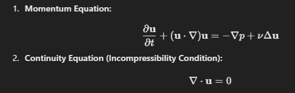
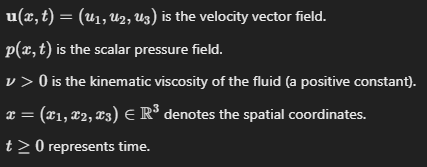

Problem 2  
Global Solutions in Computational Fluid Dynamics 

The following statements respectively define 1) the momentum of liquid flow in 3-dimensions, and 2) the incompressibility of liquids over time:

Where:  

i) Prove that a smooth solution U(x,t) and associated pressure p(x,t), exists for all t

Hint: To verify that your solution is global, prove there no singularities (flow interactions leading to numerical instability in the norms of momentum equation 1)
