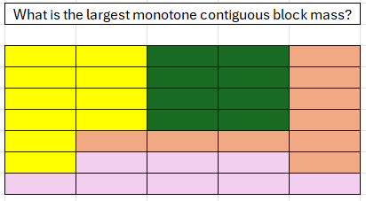

1) Elliot's interview question

input: shown  
output: 10

i) Please create a solution to this problem in pseudo code, defining a close loop algorithm returning the area of the largest contiguous colour mass of generic NxM dimensions, as shown above.

ii) Please describe the structure of the input to your program (how are the grid and its constituents represented as an object) and any patterns used

iii) Please create a problem